# 📘 MANUAL DE USUARIO - MercaFacil

## 1. Información del Proyecto

**Nombre del Proyecto:** MercaFacil  
**Estudiante:** Juan Sebastian Iguaran Davila  
**Curso:** DESARROLLO WEB  
**Semestre:** 8  
**Fecha:** 18/11/25  
**Instructor:** JAIDER QUINTERO

**Descripción del Proyecto:**  
MercaFacil es una plataforma de marketplace integral que facilita las interacciones entre clientes y vendedores. El sistema gestiona todo el ciclo de vida del e-commerce, incluyendo catálogo de productos, procesamiento de pedidos, pagos, seguimiento de envíos y un sistema de reseñas. Cuenta con un robusto sistema de Control de Acceso Basado en Roles (RBAC) para proteger recursos y gestionar permisos de usuarios (Administradores, Vendedores, Clientes).

## 2. Descripción General del Sistema

### 2.1 Interfaz Principal
La plataforma MercaFacil presenta una interfaz limpia y moderna con una navegac1ión intuitiva.

****

---

## 3. Módulo de Autenticación

### 3.1 Inicio de Sesión

**Descripción:** Acceso seguro al sistema mediante usuario y contraseña.

**Pasos:**
1. Dirigirse a la página de **Iniciar Sesión**.
2. Ingresar el nombre de usuario o correo electrónico.
3. Ingresar la contraseña.
4. Hacer clic en el botón **Iniciar Sesión**.
5. El sistema valida las credenciales y redirige al dashboard.

**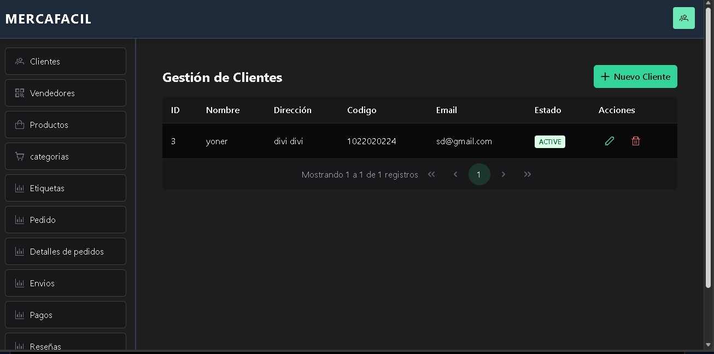**

---

### 3.2 Registro de Nuevo Usuario

**Descripción:** Crear una nueva cuenta en el sistema.

**Pasos:**
1. Hacer clic en **¿No tienes cuenta? Regístrate**.
2. Completar los campos requeridos:
   - Nombre completo
   - Correo electrónico
   - Contraseña
   - Confirmar contraseña
3. Aceptar términos y condiciones.
4. Hacer clic en **Registrarse**.
5. El sistema crea la cuenta y redirige a iniciar sesión.

****

**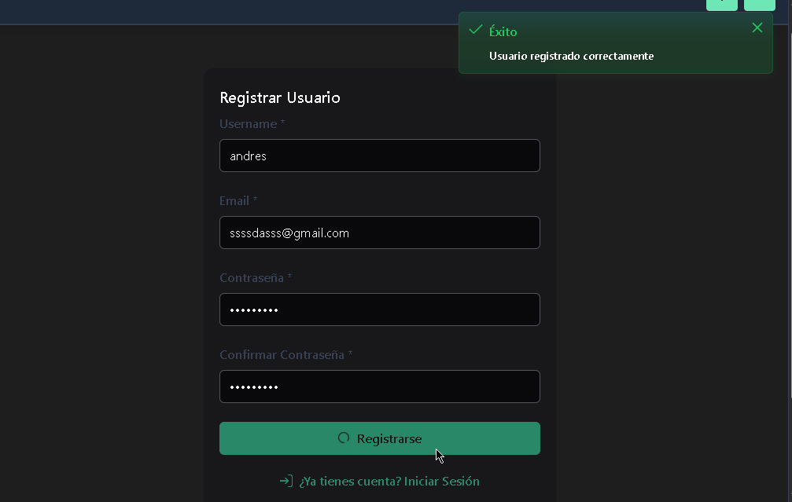**

---

## 4. Módulo de Categorías

### 4.1 Ver Categorías

**Descripción:** Visualizar todas las categorías disponibles en el sistema.

**Pasos:**
1. Desde el menú lateral, hacer clic en **Categorías**.
2. Se muestra una tabla con todas las categorías activas.
3. Cada fila contiene: Nombre, Descripción, Estado.

****

---

### 4.2 Crear Nueva Categoría

**Descripción:** Agregar una nueva categoría de productos.

**Pasos:**
1. En la vista de Categorías, hacer clic en el botón **+ Nueva Categoría**.
2. Completar el formulario:
   - **Nombre:** Nombre de la categoría (ej: "Electrónica").
   - **Descripción:** Texto descriptivo de la categoría.
3. Hacer clic en **Guardar**.
4. El sistema muestra un mensaje de éxito y la nueva categoría aparece en la tabla.

**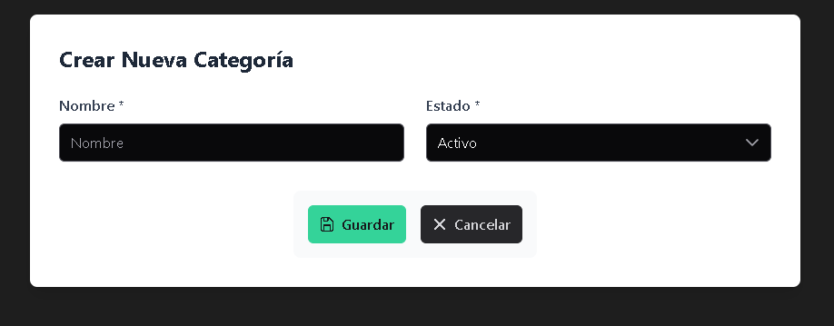**

---

### 4.3 Editar Categoría

**Descripción:** Modificar los datos de una categoría existente.

**Pasos:**
1. En la tabla de Categorías, buscar la categoría a editar.
2. Hacer clic en el botón **Editar** (icono de lápiz).
3. Se abre el formulario con los datos actuales.
4. Modificar los campos necesarios.
5. Hacer clic en **Actualizar**.
6. El sistema confirma la actualización.

**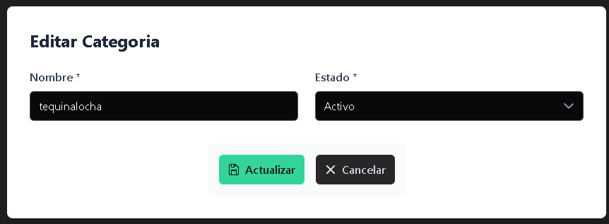**

---

### 4.4 Eliminar Categoría

**Descripción:** Eliminar una categoría del sistema (eliminación lógica).

**Pasos:**
1. En la tabla de Categorías, localizar la categoría a eliminar.
2. Hacer clic en el botón **Eliminar** (icono de basura).
3. Se muestra un diálogo de confirmación.
4. Hacer clic en **Confirmar**.
5. La categoría se marca como inactiva y desaparece de la lista.

****

---

## 5. Módulo de Productos

### 5.1 Ver Productos

**Descripción:** Visualizar el catálogo completo de productos disponibles.

**Pasos:**
1. Desde el menú lateral, hacer clic en **Productos**.
2. Se muestra una tabla con los productos activos.
3. Cada producto muestra: Nombre, Precio, Categoría, Vendedor, Estado.
4. Usar la barra de búsqueda para filtrar productos.

**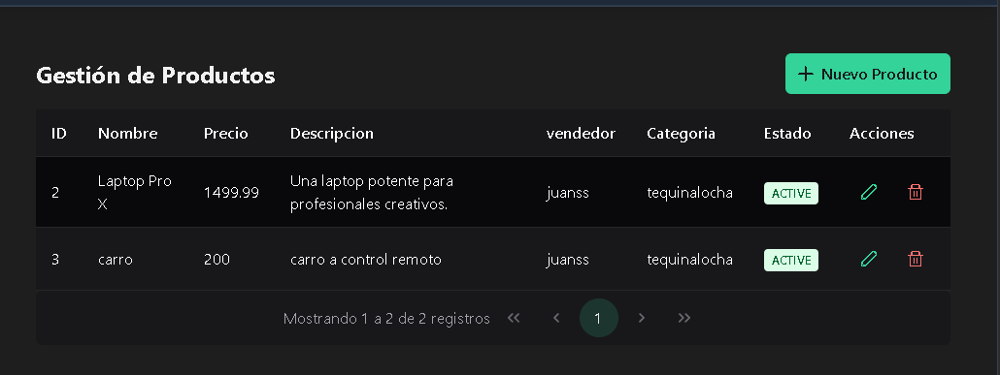**

---

### 5.2 Crear Nuevo Producto

**Descripción:** Agregar un nuevo producto al catálogo.

**Pasos:**
1. En la vista de Productos, hacer clic en **+ Nuevo Producto**.
2. Completar el formulario:
   - **Nombre:** Nombre del producto.
   - **Descripción:** Detalles del producto.
   - **Precio:** Precio unitario.
   - **Categoría:** Seleccionar categoría de la lista desplegable.
   - **Vendedor:** Seleccionar vendedor.
   - **Imágenes:** Subir fotografía del producto (opcional).
3. Hacer clic en **Guardar**.
4. El producto se agrega al catálogo.

****

---

### 5.3 Editar Producto

**Descripción:** Modificar la información de un producto existente.

**Pasos:**
1. En la tabla de Productos, buscar el producto.
2. Hacer clic en **Editar**.
3. Modificar los campos necesarios.
4. Hacer clic en **Actualizar**.
5. El sistema guarda los cambios.

****

---

### 5.4 Eliminar Producto

**Descripción:** Eliminar un producto del catálogo.

**Pasos:**
1. Localizar el producto en la tabla.
2. Hacer clic en **Eliminar**.
3. Confirmar la acción en el diálogo.
4. El producto se marca como inactivo.

****

---

## 6. Módulo de Clientes

### 6.1 Ver Clientes

**Descripción:** Visualizar lista de todos los clientes registrados.

**Pasos:**
1. Desde el menú lateral, hacer clic en **Clientes**.
2. Se muestra tabla con clientes activos.
3. Información visible: Nombre, Cédula, Email, Teléfono, Estado.

**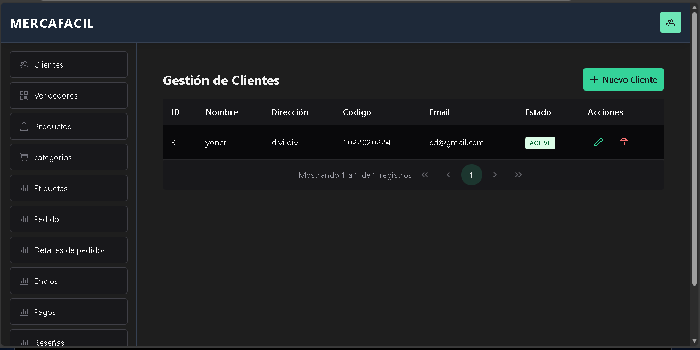**

---

### 6.2 Crear Cliente

**Descripción:** Registrar un nuevo cliente en el sistema.

**Pasos:**
1. Hacer clic en **+ Nuevo Cliente**.
2. Completar el formulario:
   - **Nombre Completo**
   - **Cédula / ID**
   - **Correo Electrónico**
   - **Teléfono**
   - **Dirección**
3. Hacer clic en **Guardar**.
4. El cliente se agrega al sistema.

****
---

### 6.3 Editar Cliente

**Descripción:** Actualizar información de un cliente.

**Pasos:**
1. Localizar cliente en tabla.
2. Hacer clic en **Editar**.
3. Modificar campos necesarios.
4. Hacer clic en **Actualizar**.

****

---

### 6.4 Eliminar Cliente

**Descripción:** Eliminar cliente del sistema.

**Pasos:**
1. Hacer clic en **Eliminar** junto al cliente.
2. Confirmar eliminación.
3. Cliente se marca como inactivo.

****

**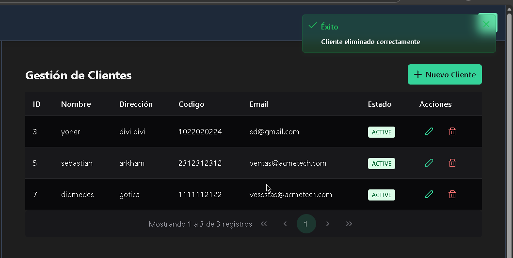**

---

## 7. Módulo de Vendedores

### 7.1 Ver Vendedores

**Descripción:** Visualizar lista de vendedores activos.

**Pasos:**
1. Hacer clic en **Vendedores** en el menú.
2. Se muestra tabla con vendedores.
3. Información: Nombre, Teléfono, Email, Estado.

****

---

### 7.2 Crear Vendedor

**Descripción:** Registrar un nuevo vendedor.

**Pasos:**
1. Hacer clic en **+ Nuevo Vendedor**.
2. Completar:
   - **Nombre de Tienda**
   - **Teléfono**
   - **Email**
   - **Dirección**
3. Hacer clic en **Guardar**.

****

---

### 7.3 Editar Vendedor

**Descripción:** Modificar información del vendedor.

**Pasos:**
1. Hacer clic en **Editar**.
2. Cambiar datos necesarios.
3. Hacer clic en **Actualizar**.

****

---

### 7.4 Eliminar Vendedor

**Descripción:** Eliminar un vendedor.

**Pasos:**
1. Hacer clic en **Eliminar**.
2. Confirmar.

****

---

## 8. Módulo de Pedidos

### 8.1 Ver Pedidos

**Descripción:** Visualizar todos los pedidos realizados.

**Pasos:**
1. Hacer clic en **Pedidos** en el menú.
2. Se muestra tabla con pedidos.
3. Información: ID Pedido, Cliente, Total, Estado, Fecha.

**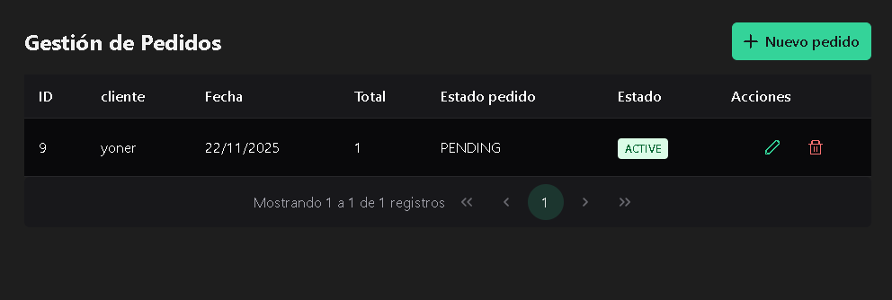**

---

### 8.2 Crear Pedido

**Descripción:** Registrar un nuevo pedido.

**Pasos:**
1. Hacer clic en **+ Nuevo Pedido**.
2. Completar:
   - **Cliente:** Seleccionar de lista desplegable.
   - **Estado:** PENDIENTE / PAGADO / ENVIADO.
   - **Fecha:** Seleccionar fecha del calendario.
3. Hacer clic en **Guardar**.
4. El pedido se crea en el sistema.

****
---

### 8.3 Editar Pedido

**Descripción:** Modificar estado o datos de un pedido.

**Pasos:**
1. Buscar pedido en tabla.
2. Hacer clic en **Editar**.
3. Cambiar estado o datos.
4. Hacer clic en **Actualizar**.

****

---

### 8.4 Eliminar Pedido

**Descripción:** Eliminar un pedido (marcarlo como inactivo).

**Pasos:**
1. Hacer clic en **Eliminar**.
2. Confirmar en diálogo.
3. Pedido se marca como inactivo.

**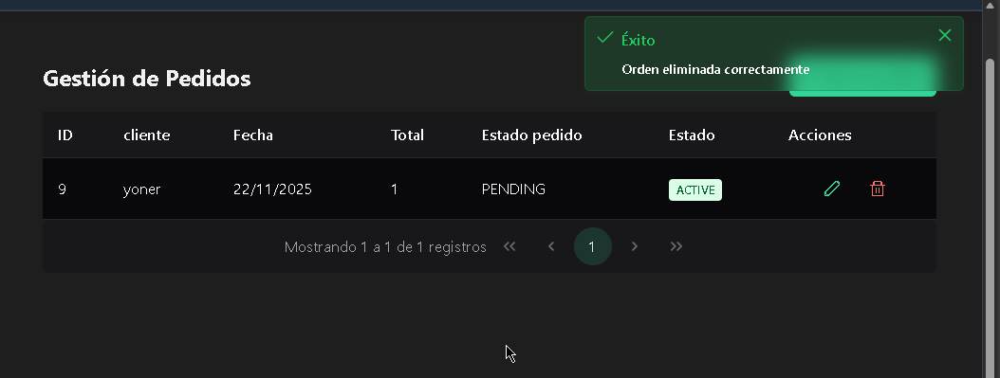**
---

## 10. Módulo de Pagos

### 10.1 Ver Pagos

**Descripción:** Visualizar registro de pagos realizados.

**Pasos:**
1. Hacer clic en **Pagos** en el menú.
2. Se muestra tabla con pagos.
3. Información: Pedido, Monto, Método, Fecha, Estado.

**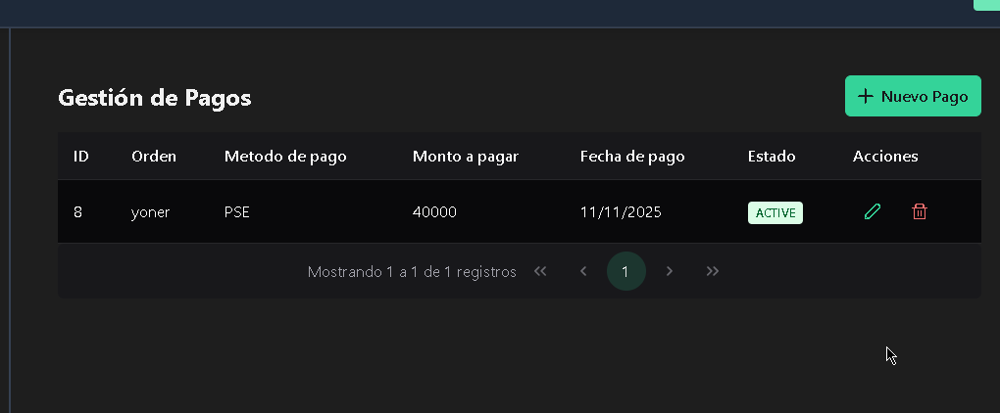**

---

### 10.2 Crear Pago

**Descripción:** Registrar un nuevo pago.

**Pasos:**
1. Hacer clic en **+ Nuevo Pago**.
2. Completar:
   - **Pedido:** Seleccionar pedido.
   - **Monto:** Cantidad pagada.
   - **Método:** Tarjeta / Transferencia / Efectivo.
   - **Fecha:** Fecha del pago.
3. Hacer clic en **Guardar**.

****
---

### 10.3 Editar Pago

**Descripción:** Modificar datos de un pago.

**Pasos:**
1. Hacer clic en **Editar**.
2. Cambiar información.
3. Hacer clic en **Actualizar**.

****

---

### 10.4 Eliminar Pago

**Descripción:** Eliminar registro de pago.

**Pasos:**
1. Hacer clic en **Eliminar**.
2. Confirmar eliminación.

****
****
---

## 11. Módulo de Envíos

### 11.1 Ver Envíos

**Descripción:** Visualizar información de envíos.

**Pasos:**
1. Hacer clic en **Envíos** en el menú.
2. Se muestra tabla con envíos.
3. Información: Pedido, Dirección, Estado, Fecha de Entrega.

****

---

### 11.2 Crear Envío

**Descripción:** Registrar un nuevo envío.

**Pasos:**
1. Hacer clic en **+ Nuevo Envío**.
2. Completar:
   - **Pedido:** Seleccionar pedido.
   - **Dirección de Entrega**
   - **Fecha Estimada**
   - **Transportista** (opcional)
3. Hacer clic en **Guardar**.

**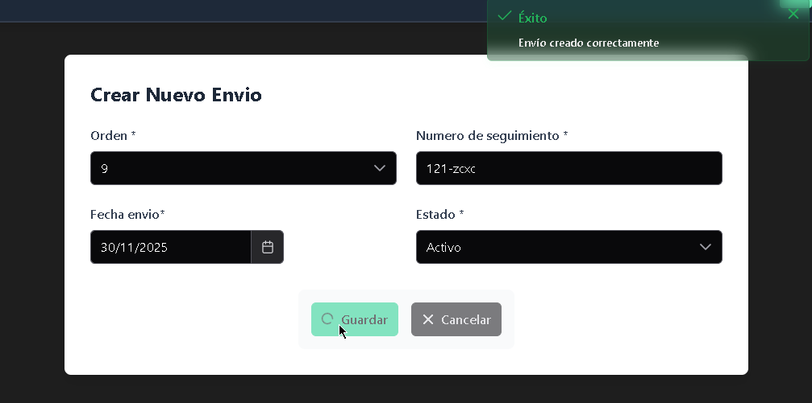**

---

### 11.3 Editar Envío

**Descripción:** Actualizar información del envío (dirección, estado).

**Pasos:**
1. Hacer clic en **Editar**.
2. Cambiar datos.
3. Hacer clic en **Actualizar**.

**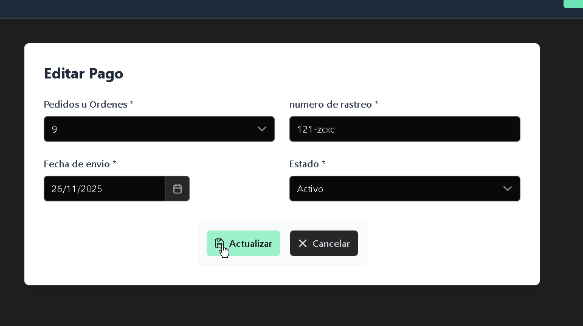**

---

### 11.4 Eliminar Envío

**Descripción:** Eliminar registro de envío.

**Pasos:**
1. Hacer clic en **Eliminar**.
2. Confirmar.

****
****
---

## 12. Módulo de Reseñas

### 12.1 Ver Reseñas

**Descripción:** Visualizar reseñas de productos.

**Pasos:**
1. Hacer clic en **Reseñas** en el menú.
2. Se muestra tabla con reseñas.
3. Información: Producto, Cliente, Calificación, Comentario, Fecha.

**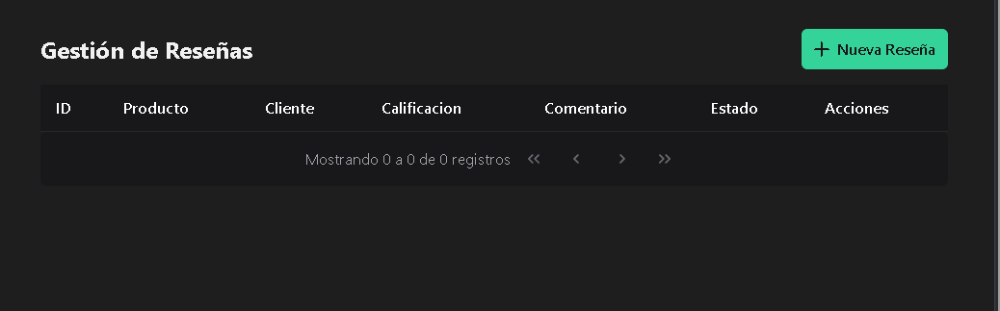**

---

### 12.2 Crear Reseña

**Descripción:** Agregar una nueva reseña a un producto.

**Pasos:**
1. Hacer clic en **+ Nueva Reseña**.
2. Completar:
   - **Producto:** Seleccionar producto.
   - **Cliente:** Seleccionar cliente.
   - **Calificación:** 1-5 estrellas.
   - **Comentario:** Texto de la reseña.
3. Hacer clic en **Guardar**.

**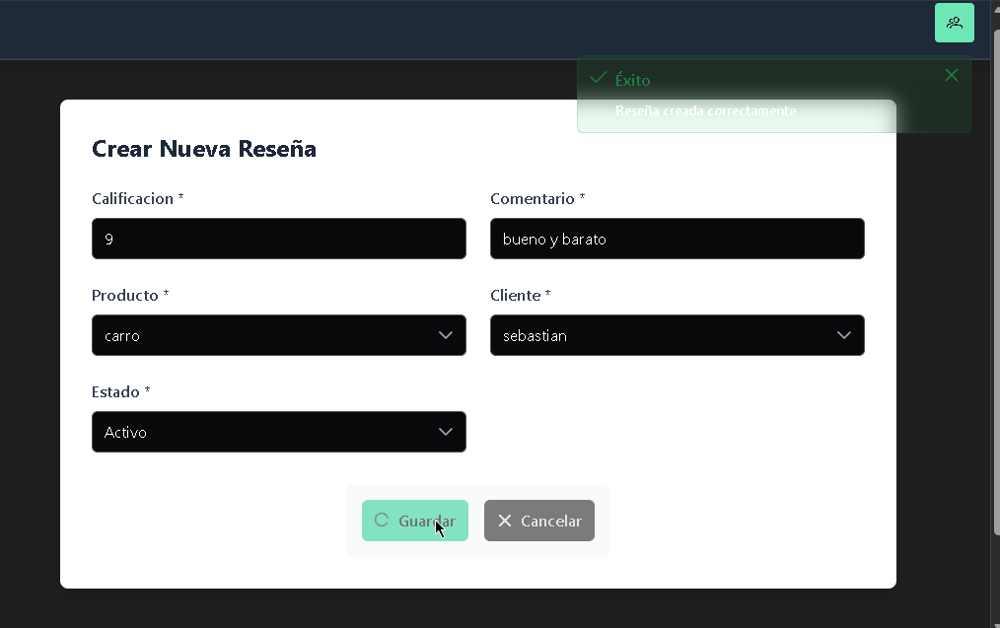**

---

### 12.3 Editar Reseña

**Descripción:** Modificar una reseña existente.

**Pasos:**
1. Hacer clic en **Editar**.
2. Cambiar calificación o comentario.
3. Hacer clic en **Actualizar**.

**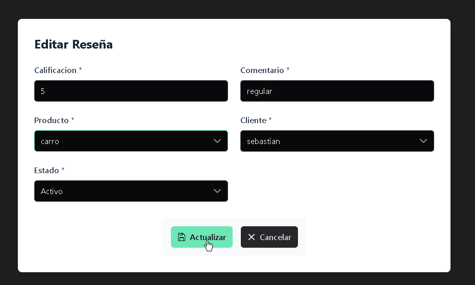**

---

### 12.4 Eliminar Reseña

**Descripción:** Eliminar una reseña.

**Pasos:**
1. Hacer clic en **Eliminar**.
2. Confirmar.

**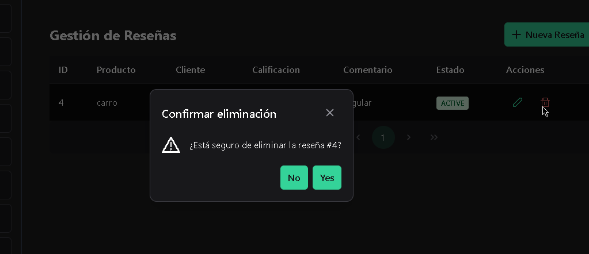**
****

---

## 13. Módulo de Etiquetas

### 13.1 Ver Etiquetas

**Descripción:** Visualizar etiquetas para clasificar productos.

**Pasos:**
1. Hacer clic en **Etiquetas** en el menú.
2. Se muestra tabla con etiquetas.
3. Información: Nombre, Descripción, Estado.

****

---

### 13.2 Crear Etiqueta

**Descripción:** Crear una nueva etiqueta.

**Pasos:**
1. Hacer clic en **+ Nueva Etiqueta**.
2. Completar:
   - **Nombre:** Nombre de la etiqueta.
   - **Descripción:** Descripción breve.
3. Hacer clic en **Guardar**.

****

---

### 13.3 Editar Etiqueta

**Descripción:** Modificar una etiqueta.

**Pasos:**
1. Hacer clic en **Editar**.
2. Cambiar datos.
3. Hacer clic en **Actualizar**.

**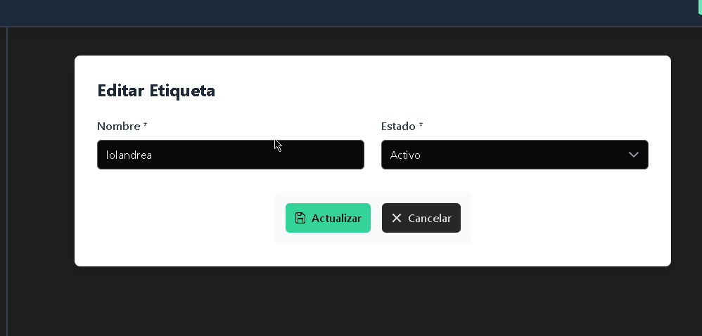**

---

### 13.4 Eliminar Etiqueta

**Descripción:** Eliminar una etiqueta.

**Pasos:**
1. Hacer clic en **Eliminar**.
2. Confirmar.

****
**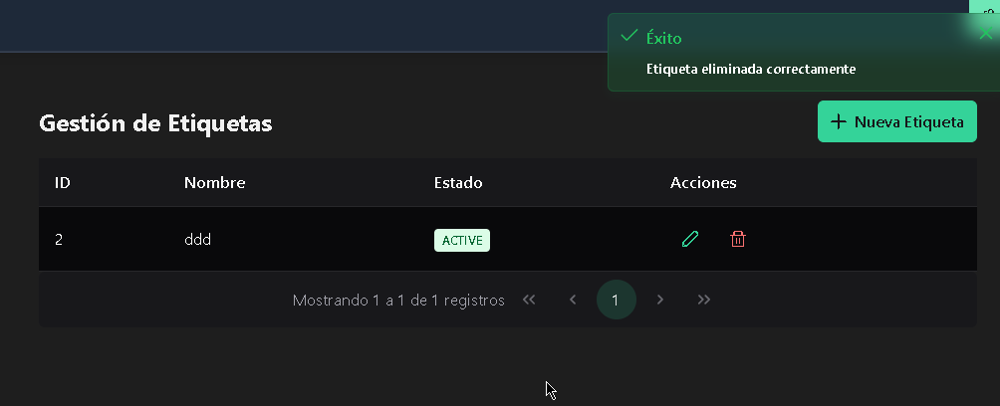**

---

## 15. Características de la Interfaz

### 15.1 Navegación Principal

La interfaz cuenta con:

- **Menú Lateral:** Acceso a todos los módulos (Productos, Clientes, Pedidos, etc.).
- **Barra Superior:** Información de usuario, notificaciones, tema (oscuro/claro).
- **Pie de Página:** Información de copyright y enlace a términos.

****

---

### 15.2 Formularios

Los formularios incluyen:

- **Validación en Tiempo Real:** Mensajes de error debajo de campos.
- **Campos Obligatorios:** Marcados con asterisco (*).
- **Listas Desplegables:** Para seleccionar opciones predefinidas.
- **Calendario:** Para seleccionar fechas.

**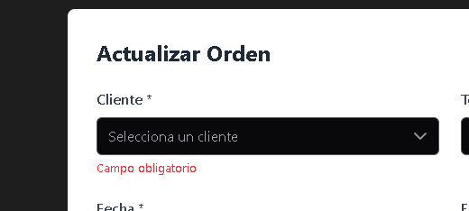**
****
**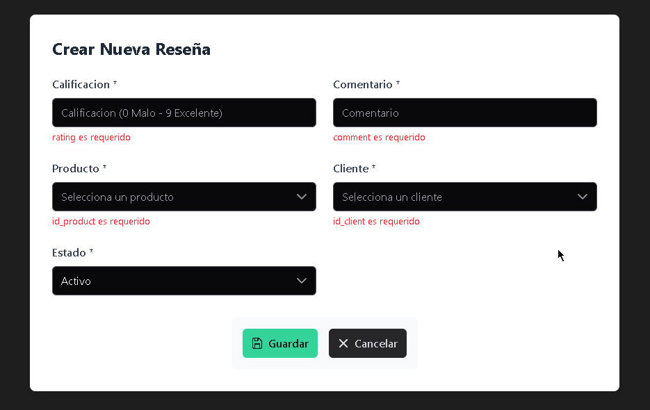**
---

### 15.3 Notificaciones

El sistema muestra:

- **Mensajes de Éxito:** (Verde) Al guardar o actualizar correctamente.
**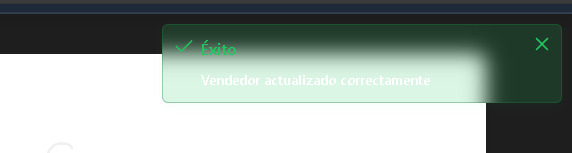**
- **Mensajes de Error:** (Rojo) Cuando hay problemas.
****
- **Mensajes de Advertencia:** (Amarillo) Para confirmaciones importantes.
****

---

## 16. Guía de Resolución de Problemas

### Problema: No puedo iniciar sesión

**Solución:**
1. Verificar que el nombre de usuario o correo sean correctos.
2. Verificar que la contraseña sea correcta (distingue mayúsculas/minúsculas).
3. Si olvidó la contraseña, contactar al administrador.
4. Verificar que la conexión a internet esté activa.

---

### Problema: El formulario no se envía

**Solución:**
1. Revisar que todos los campos obligatorios (con *) estén completados.
2. Verificar que los datos sean válidos (ej: email con formato correcto).
3. Revisar los mensajes de error debajo de los campos.
4. Recargar la página (F5) e intentar nuevamente.

---

### Problema: Las cambios no se guardan

**Solución:**
1. Verificar que hizo clic en **Guardar** o **Actualizar**.
2. Esperar a que aparezca el mensaje de confirmación.
3. Verificar la conexión a internet.
4. Si persiste, contactar al soporte técnico.

---

### Problema: No veo los datos en las tablas

**Solución:**
1. Verificar que haya datos creados en ese módulo.
2. Revisar que no haya filtros activos que oculten los datos.
3. Recargar la página (F5).
4. Verificar permisos de acceso (según rol de usuario).

---

## 17. Recomendaciones de Uso

1. **Cambiar Contraseña Regularmente:** Por seguridad, cambiar contraseña cada 90 días.
2. **Usar Navegador Moderno:** Chrome, Firefox o Edge recomendados.
3. **No Compartir Credenciales:** Cada usuario debe tener su propia cuenta.
4. **Respaldar Datos:** Si es administrador, realizar respaldos periódicos.
5. **Reportar Errores:** Si encuentra un problema, contactar inmediatamente al soporte.

---

## 18. Contacto y Soporte

Para reportar problemas o solicitar asistencia:

- **Email:** soporte@mercafacil.com
- **Teléfono:** +57 (57) 304-4611483
- **Horario de Atención:** Lunes a Viernes 8:00 AM - 6:00 PM

---

## 19. Anexos

- **Glosario de Términos:** Definiciones de conceptos técnicos.
- **Atajos de Teclado:** Combinaciones rápidas (si aplica).
- **Preguntas Frecuentes (FAQ):** Respuestas a dudas comunes.

---

**Documento Generado:** 18/11/2025  
**Versión:** 1.0